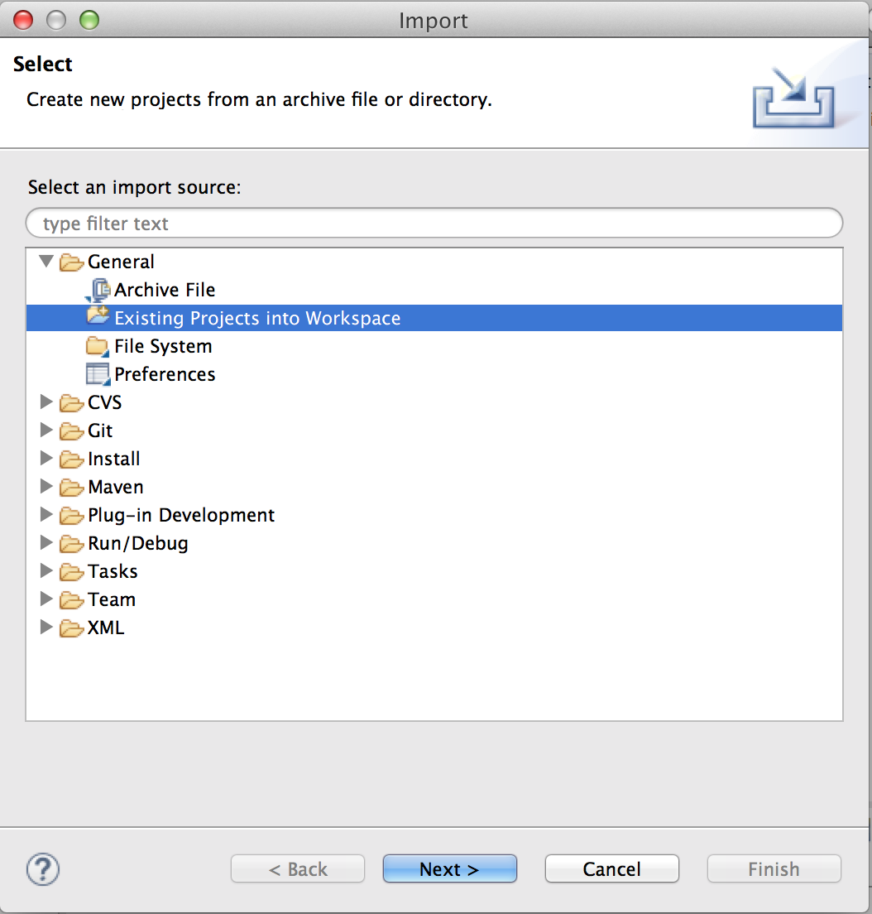
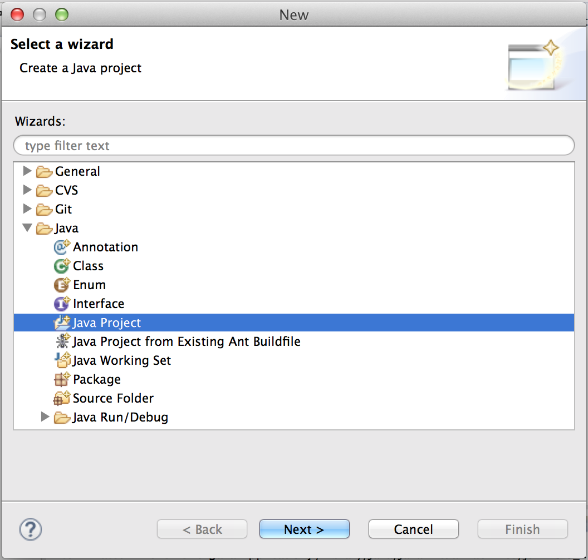

# Working with Eclipse projects

Working with Eclipse can be a little bit tricky at first, but. There are usually many correct ways to do things, but they don't all work all the time.

## Importing an Eclipse project

You can import a project into eclipse by either going to the file menu or right-clicking in the package explorer:

 |  **OR** | 

Then go to General > Existing Projects into Workspace | | select archive file, and browse to the zip file on your computer.
 | |  

If you (or your computer) has unzipped the project, select "root directory" instead and browse to the folder.

## Exporting an Eclipse project

Whenever you submit an assignment, you will need to export it from Eclipse as a zip file. The simplest way to export a project in Eclipse is to right-click on the project in the package explorer:

| Select "Export" | | Navigate to General > Archive file... |
|  | |  |

...and choose the path to the archive file. 

## Deleting an Eclipse project

In an Eclipse workspace, you can only have one project with the same name. That means if you want to try a WOD again that relies on *importing* a project, rather than creating a new one from scratch, you will need to either:

1. Create a new workspace,
2. Rename your last attempt, **OR**
3. Delete your last attempt

When deleting a project from eclipse, make sure you delete the contents from disk so you don't have naming conflicts in future:

*This **cannot** be undone*, so make sure you don't want the code anymore!

## Creating a new Eclipse project

As with importing, you can create a new Java project in eclipse by either going to the file menu or right-clicking in the package explorer:

 |  **OR** | 

If you don't see the Java Project option, go to "Other"...

... and navigate to Java > Java Project.

Next, name your project and hit "Finish".

