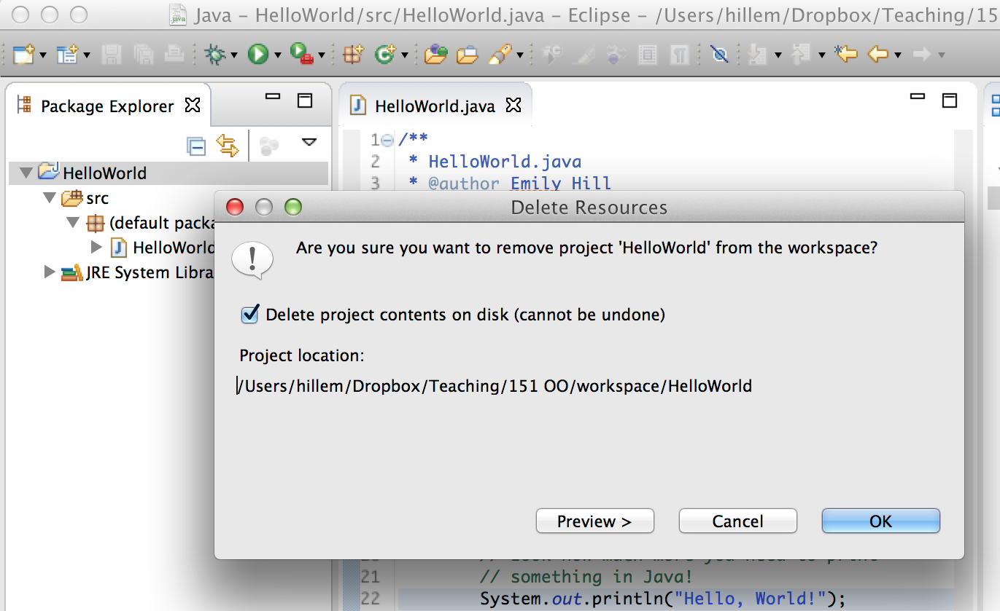

# Eclipse Tips

## Renaming

Rename any entity (project, class, method, variable) by right-clicking on it and selecting "Refactor > Rename"

## Lost your view?

Accidentally close part of your window? Go to "Window > Reset Perspective..."

## Auto indent

Quickly fix your indentation into a human readable form by selecting `command/control + A` to select all and the `command/control + I` to indent.

## Multiple projects with the same name

In an Eclipse workspace, you can only have one project with the same name. That means if you want to try a WOD again that relies on *importing* a project, rather than creating a new one from scratch, you will need to either:

1. Create a new workspace,
2. Rename your last attempt, **OR**
3. Delete your last attempt

When deleting a project from eclipse, make sure you delete the contents from disk so you don't have naming conflicts in future:

*This **cannot** be undone*, so make sure you don't want the code anymore!
