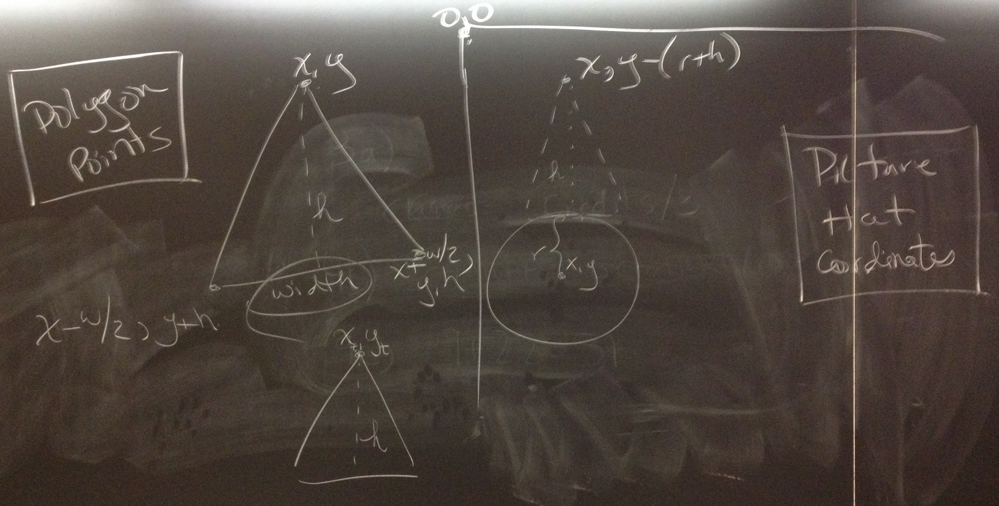
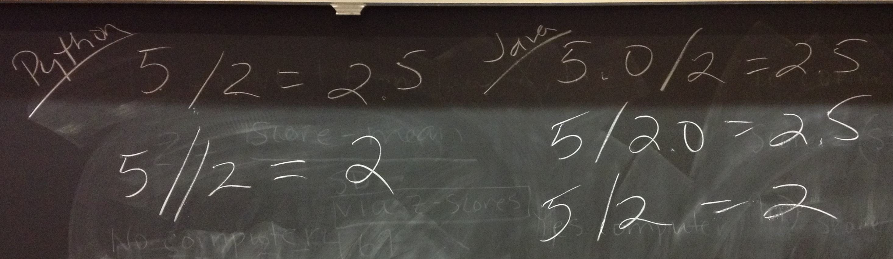
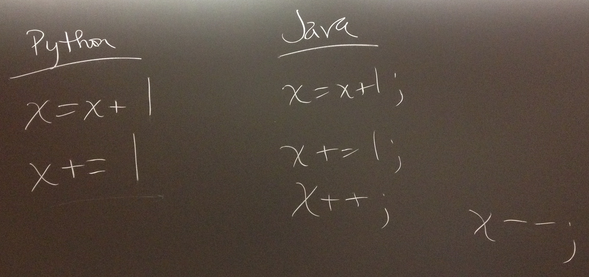
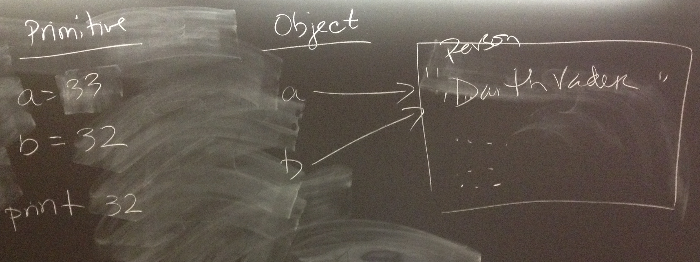

# Board Notes

## 2/11

How we positioned the triangle above the circle in Picture: 
 

Java division: 
 

## 2/16

Ways to increment in Java: 
 

Primitive vs object type example from slides: 
 