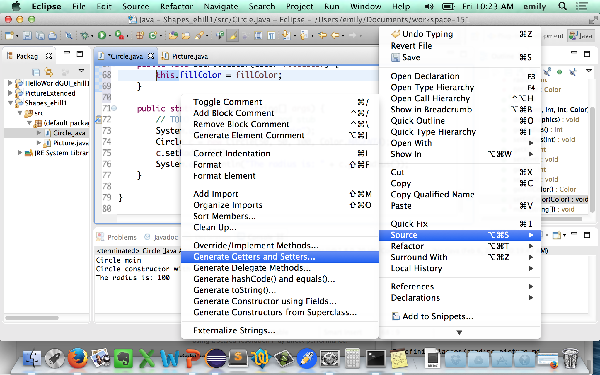

# Eclipse Tips

In this week's edition of eclipse tips, we'll generate getters and setters.

## Generating getters & setters

Right-click in your editor window and select `Source > Generate Getters & Setters...`

Select the fields you want get & set methods generated for, and where in the class file you'd like Eclipse to put them.