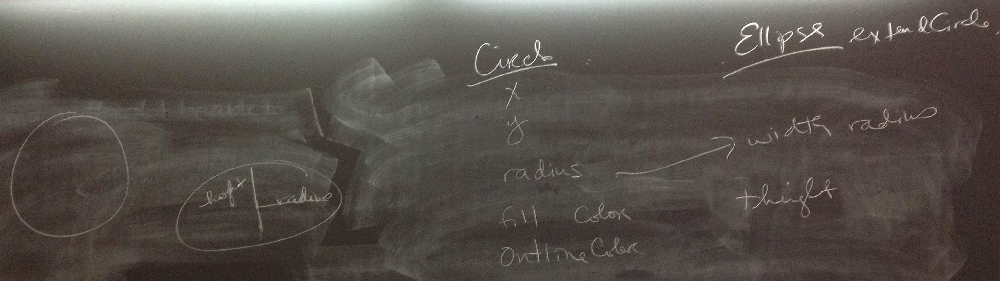

# Board Notes & Demo Code

## 2/18

How circle and ellipse are related: 
 

 * Circle as a super class: [Shapes_2_18.zip](Shapes_2_18.zip)
 * Ellipse as a super class: [Shapes_2_20.zip](Shapes_2_20.zip)
