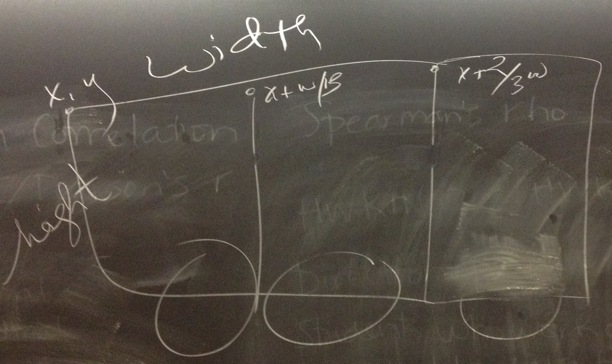

# Board Notes & Demo Code

## 2/23 & 2/25

### Drawing BoxCar

Wheel in BoxCarPart object code should be relative to box car rectangle: 

How to draw wheel relative to box car part: 

Drawing 3 BoxCarPart objects relative to overall BoxCar: 

### Code

 * My project code: [BoxCar_2_23.zip](BoxCar_2_23.zip)
 * BoxCar with a list: [BoxCar_2_25.zip](BoxCar_2_25.zip)

### Evolution

BoxCarPart: 

BoxCar: 

BoxCar with 5 wheels: 

BoxCar with 10 wheels: 
