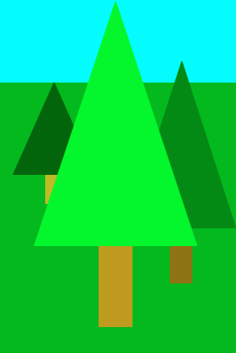

# PWOD6: Forest

In class we saw how to compose objects to create a BoxCar class, and in [PWOD5]({{ site.baseurl }}/morea/06.Composition/pwod5.html) you created a Tree class. Now we're going to create another composite shape: Forest.



## Instructions

1. *Start your timer* 
1. If you haven't been following along in class, download the [Picture Project]({{ site.baseurl }}/morea/06.Composition/Picture_tree.zip) and import it into your workspace.
1. Create a new `Forest` class with:
    * Fields: at least 3 Trees (using a Collection such as ArrayList recommended). When drawn, the trees should overlap a little bit. For example:  
    
    * A constructor with 4 parameters: `x`, `y`, `width`, & `height`. The width & height represent the overall width & height of the forest, *not* an individual tree.
    * A `draw` method that has a `Graphics` parameter and calls the corresponding draw methods for the trees.
1. Test your new `Forest` class by replacing your `Tree` field(s) in the Picture class. 
1. Modify the position & sizes in the Picture class to change the look of your forest(s). Look at how easy it is to aggregate (i.e., reuse) components!
1. *Stop your timer*

## Demonstration

<!--*Coming soon...*-->

Once you've finished doing the WOD a single time, watch me do it:



### My Final Project

[Picture_forest.zip](Picture_forest.zip)


