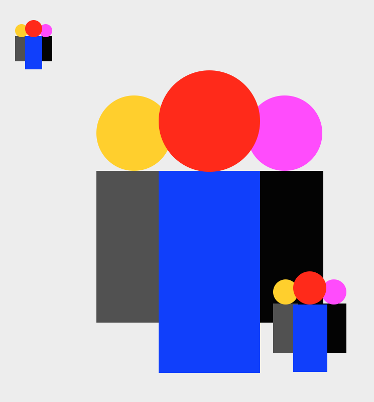
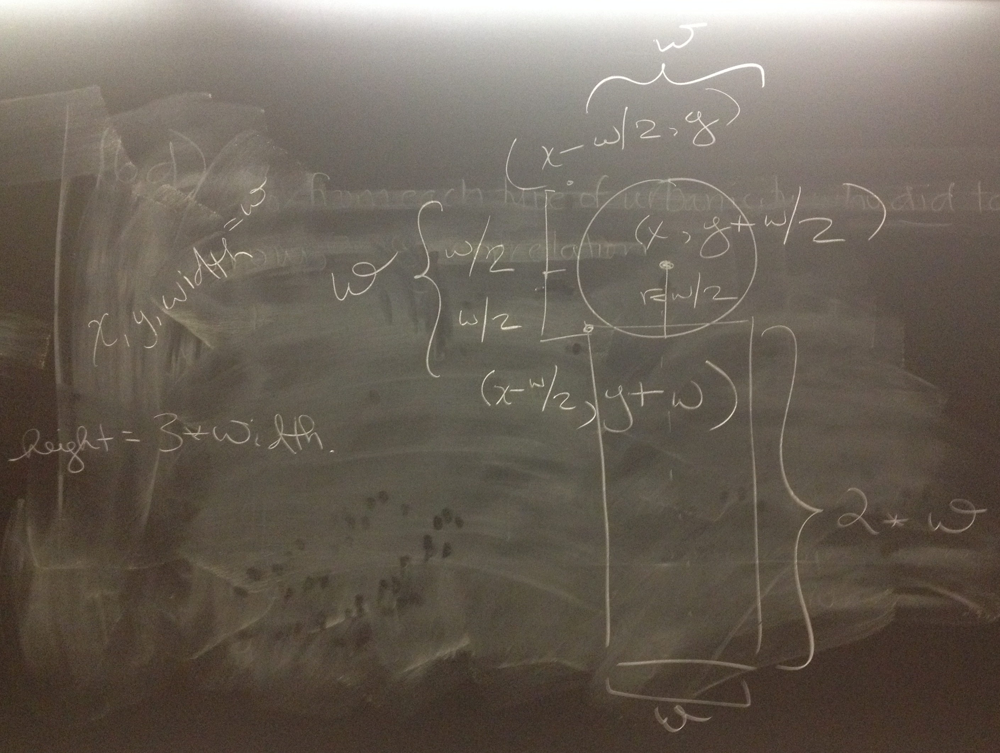

# WOD3: Person & Crowd Classes

We've looked at box cars and forests, now let's build a crowd.



<!-- started @ 10 am 10:57 - -->

## Instructions

1. Make a copy of your Picture project. If you haven't been following along in class, download the [Picture Project](Picture_starter.zip) and import it into your workspace.
2. Right-click your project and go to "Refactor > Rename" to name it `Picture_uLogin`
2. Right-click on your Picture project and go to "New > Class" to create a `Person` class.
3. At minimum, your composite person shape should consiste of a `Circle` head field and a `Rectangle` body. (You may optionally create additional fields for arms, face, hat, etc.)
4. Create a Person constructor with 3 parameters: `x`, `y`, and `width`.
5. Create a Person constructor with 5 parameters: `x`, `y`, `width`, `headColor` and `bodyColor`.
1. Create a `setBounds` method that:
      * Has 3 parameters: `x`, `y`, & `width`
      * The person starts at `x - width / 2, y` and extends to `width` & `height`. Note that the x position is in the *middle* of the person.
      * The head is the full width.
      * The body's height is 2 times the width of the person & the full width.
1. Call your `setBounds` method from the constructor.
2. Create a `draw` method that takes a `Graphics` parameter and calls the draw methods of the 2 fields
2. Add getter & setter methods for `headColor` and `bodyColor`.
1. Create a `Person` in your `Picture` class to test your code. When satisfied, move on to create a crowd.
1. Create a `Crowd` class with:
    * At least 3 `Person` fields or a single `ArrayList<Person>` field. When drawn, the people should overlap a little bit. For example, you could put two people behind the front person by reducing their size by 75% and putting them a little to the left and right of the front & centered person:  
     
    * A constructor with 3 parameters: `x`, `y`, `width`. The width represents the overall width of the crowd, *not* an individual person.
    * A `draw` method that has a `Graphics` parameter and calls the corresponding draw methods for the people.
1. Test your new `Crowd` class by replacing your `Person` field(s) in the Picture class. 
1. Add two more `Crowd` fields to your Picture (for a total of 3). Modify the position & sizes in the Picture class so each crowd looks a little bit different.
3. Export your program by right-clicking on your project folder, and selecting “Export > General > Archive File”. Name the file “Crowd_uLogin.zip”.
4. Upload your file to moodle to submit.

## Person setBounds calculations

