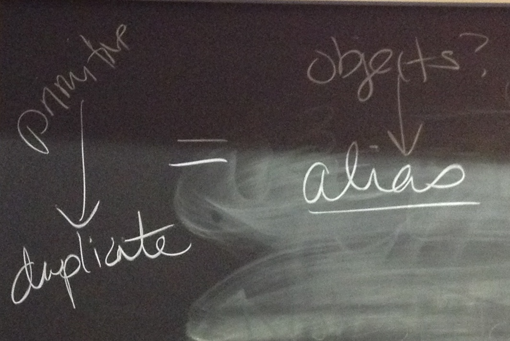
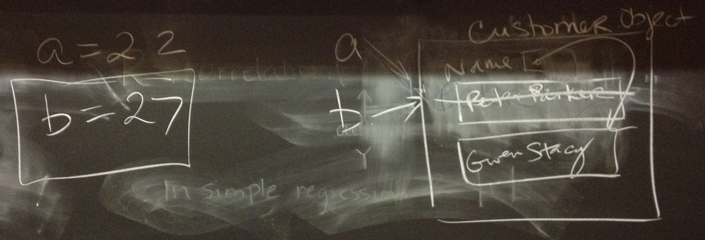
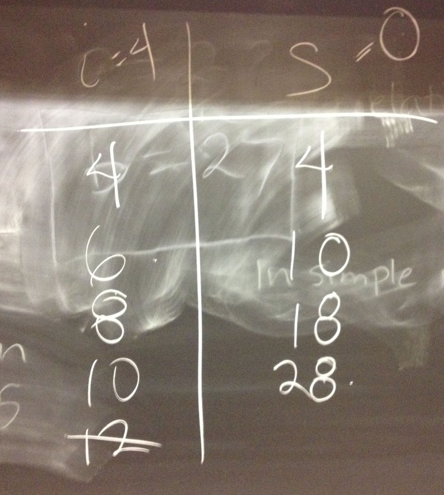

# Board Notes & Demo Code

## 3/16: Getting Person started
  * [Person_starter.zip](Person_starter.zip)
  
  
## 3/18: Getting AlphabetPanel started
  * [AlphabetPanelStarter.zip](AlphabetPanelStarter.zip)
  
## 3/20: Midterm Review

Semantics of equals for primitive vs object types:

Results in the following output:

Manual walk through of the for loop:

## 3/23: RandomString Starter
  * [RandomStringStarter.zip](RandomStringStarter.zip)
  
## 3/25: HangmanGame Starter
  * [HangmanGameStarter.zip](HangmanGameStarter.zip)