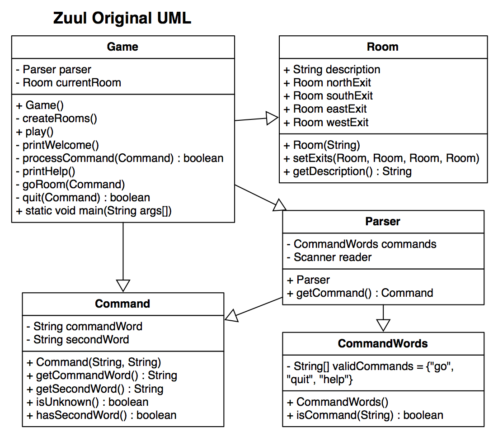

# PWOD8: World of Zuul

In this PWOD we will see how to refactor an existing Java project so that code changes are easier to make. We began this PWOD in class.



## Instructions

1. If you haven't been following along in class, download the [Zuul Starter Project](Zuul-orig.zip) and import it into your workspace. If you were following along in class, you can start from where we added the cellar: [Zuul-04_06.zip](Zuul-04_06.zip).
2. Implement the suggested changes in [Tasks.docx](Tasks.docx). Specifically, you will be moving from the original code design:

***to:***

For the final task (adding support for additional command languages besides English), it is recommended you create a [CommandWords class](CommandWords-JavaDoc.docx).

## Demonstration

<!--*Coming soon...*-->

Once you've finished doing the WOD a single time, watch me do it:



*Note:* video creates a look command for an exit, rather than the current room.

### My Final Project

[Zuul_final.zip](Zuul_final.zip)


