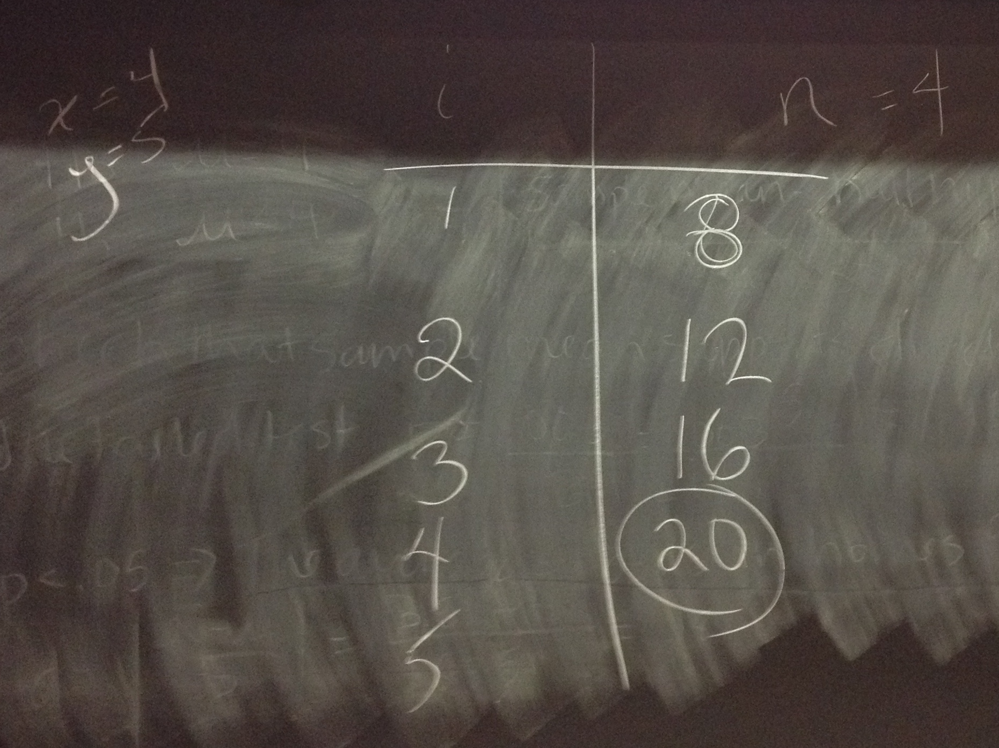
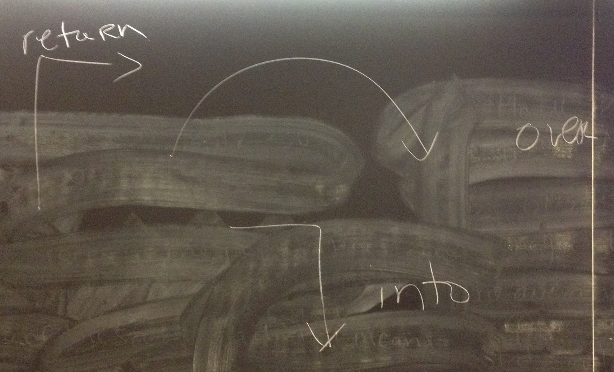

# Board Notes & Demo Code

## 4/7

  * Starter code: [SortingB.zip](SortingB.zip)

Example manual walk through:

Eclipse debugging buttons:

<!--## 4/1: Removing code duplication
  * [Zuul-04_01.zip](Zuul-04_01.zip)

## 4/6: Adding a cellar  
  * [Zuul-04_06.zip](Zuul-04_06.zip)-->
  
<!--## 3/20: Midterm Review

Semantics of equals for primitive vs object types:

Results in the following output:

Manual walk through of the for loop:

-->
