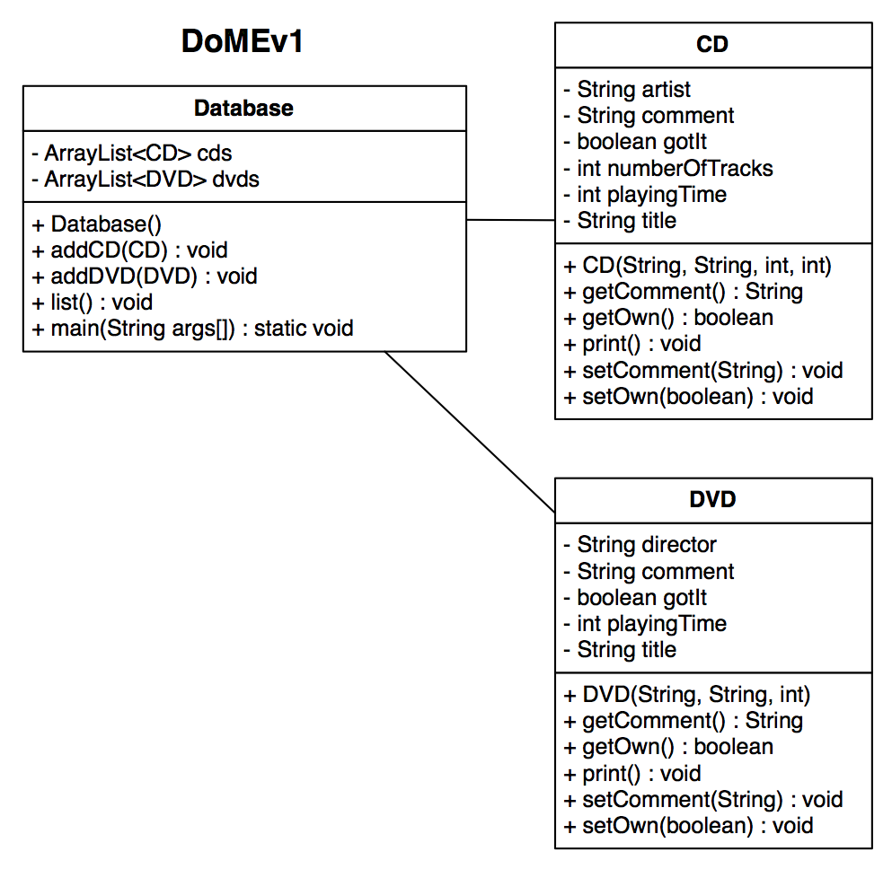
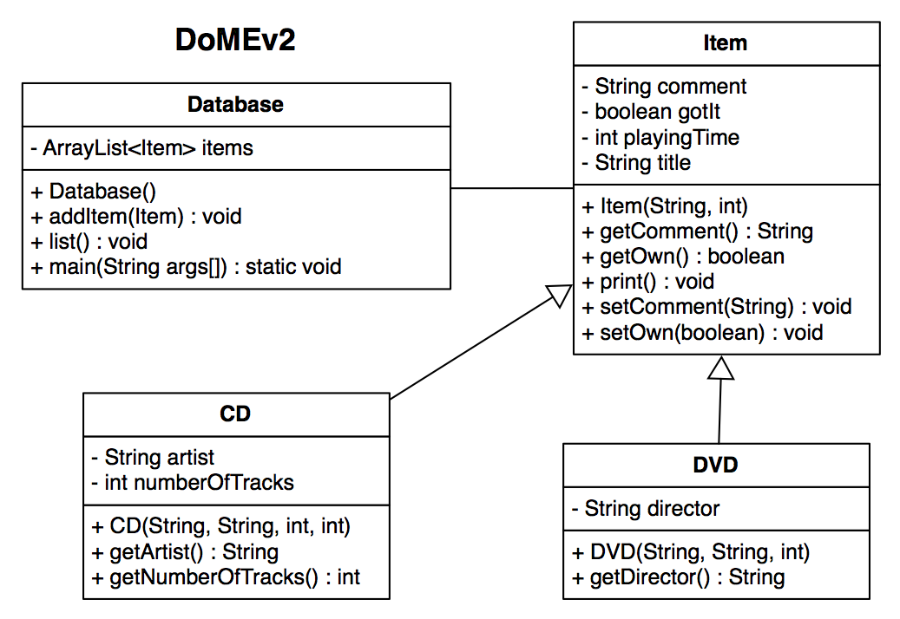
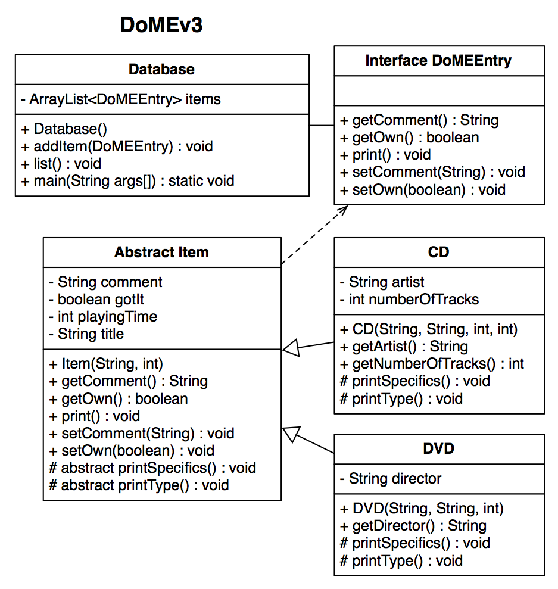

# (P)WOD10: DoMEv4

In this PWOD, you will begin to understand the difficulty of defining and implementing abstract classes & interfaces. Starting from DoMEv1, update the application to use abstract classes & interfaces to remove code duplication and make adding new types of media easier. We will be going over how to convert DoMEv1 to versions 2 & 3 in class.

<!---->

## Instructions

If you haven't been following along in class, download the [DoMEv3.zip](DoMEv3.zip) and import it into your workspace. In class, DoME went through the following updates:

What if we wanted to add support for other types of entertainment media such as Video Games to our DoME application? What types of information should we include in our DB for each of these? Is there any information that they share? Is it possible to add support for these types without changing the Database code (other than main)? How would you go about adding support for these new media types?

Draw a new class diagram (DoMEv4) for adding Video Games, Board Games,  Card Games, and BluRays. Update your implementation to support these new types. Be sure to test them in main.  

### Part 1. Draw your diagram -- SUBMIT TO MOODLE AS WOD5

Draw your class design diagram using a UML-styled notation like we’ve been doing in class. Class design diagrams are easiest to follow in graphical format. There are many free drawing programs you could use; I recommend [gliffy](http://www.gliffy.com/uml-software/). You can also draw it on paper & upload a photo, or draw on top of the existing diagram (as long as it's readable).

Each class is represented by a box with 3 sections separated by 2 lines: the class name, its fields, and its methods. Interfaces obviously have no fields, but still need an empty field section. Concrete classes are differentiated from abstract classes and interfaces using <<abstract>> and <<interface>> notations above the class name. Note that private is indicated with minus (-), public with plus (+), and protected with pound (#). After each field, parameter, and method name is a colon (:) followed by the type or return type.  Inheritance is indicated using solid arrows, interface implementation indicated with dashed arrows. A solid line shows that the Database class uses the Item interface.

### Part 2. Implement your Design -- Practice WOD Video

Make sure to test your implementation in main in the Database class by adding at least one item of each type to the DB and making sure the printed results are correct.

## Demonstration

*Coming soon...*

<!--Once you've finished doing the WOD a single time, watch me do it:

-->

