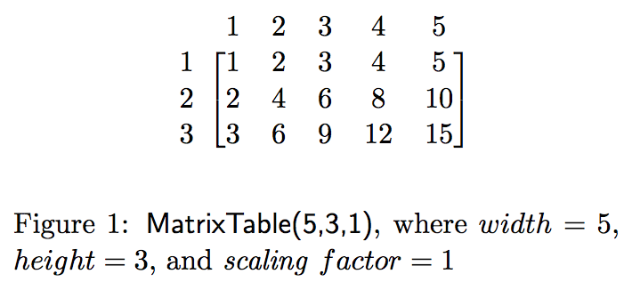
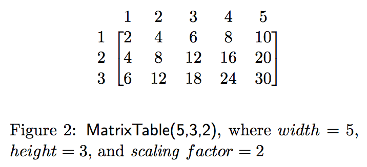

# PHW12: MultiplicationTable

In this PHW, you will practice working with two-dimensional arrays in main and as a reusable class.

<!---->

## Part 1: Understanding the problem through `main`

We will be creating a 2-dimensional array that will take a width, height, & scaling factor and create a multiplication table based on the scaling factor:

 

### Instructions

  * Create a class with a `main` method to learn the Java syntax of this particular problem.
  * Create a 3 x 5 two-dimensional array of integers like the ones in the figures above.
  * Use a nested for loop to initialize the array by multiplying the row and the column as in Figure 1.
  * Use another nested for loop to print the array to make sure you have the correct output.
  * Add a scaling factor variable at the top of your main. Multiply every value in your multiplication table by this value. If you set the scaling factor to be 2, your code should output something like Figure 2 when run.

Now that you understand what you're implementing, you're ready to try rewriting it in a reusable, object-oriented way.

### Demonstration

Once you've finished doing the practice HW a single time, watch me do it:



## Part 2: Make it reusuable with an OO `MultiplicationTable` class

### Instructions

  * Create a class `MultiplicationTable` with 2 fields: a two-dimensional integer array & a scaling factor
  * Create a constructor that takes 3 parameters: width, height, & scaling factor
    * Initialize `array[0][0] = scaling factor`
    * Initialize `array[w-1][h-1] = scaling factor * width * height`
    * Initialize all the remaining values in between as appropriate
  * Create a `print` method to print out the table
  * Create a `lookup` method that takes two indexes (of the ranges 1 to width and 1 to height) and returns the appropriate value (or 0 otherwise)
  * Test your methods in main.
  * *Optional:* Want all your numbers to line up in nice columns?

        String format = "%10d"; // padd number to take 10 spaces total
        int value = 1250;
        System.out.format(format, value);

  * *Optional:* Want all your numbers to line up relative to the length of the largest value? Figure out the length of your longest number:

        String.valueOf(biggest).length();

### Demonstration

Once you've finished doing the practice HW a single time, watch me do it:



